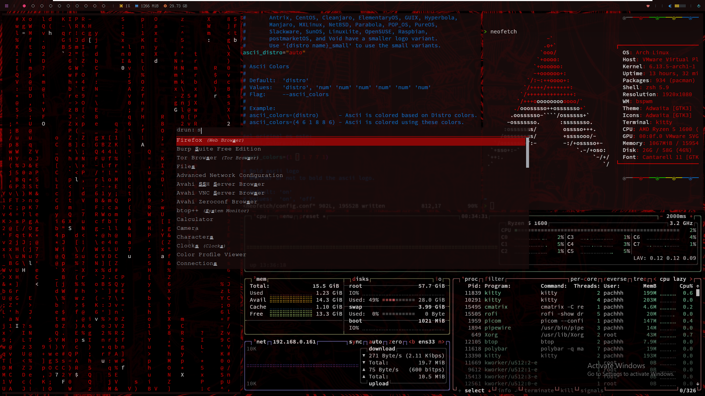
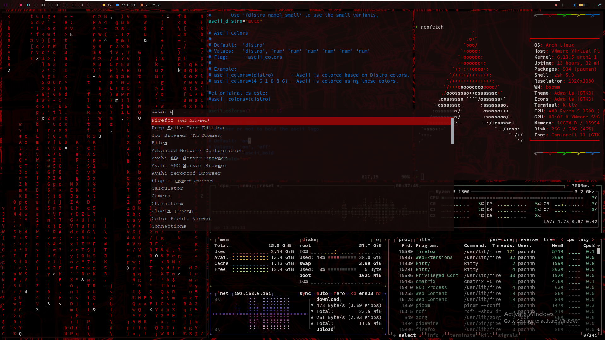

# ArchAutopwm

## Install in HOME:

1. Clone the repository:
   ```bash
   git clone https://github.com/pachhhi/ArchAutopwm
   ```

2. Navigate to the project directory:
   ```bash
   cd ArchAutopwm
   ```

3. Make the script executable:
   ```bash
   chmod +x arch-autopwm.sh
   ```

4. Run the script:
   ```bash
   ./arch-autopwm
   ```

<div style="display: flex; justify-content: space-between;">
  
  
</div>

   
